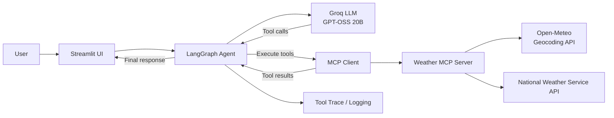
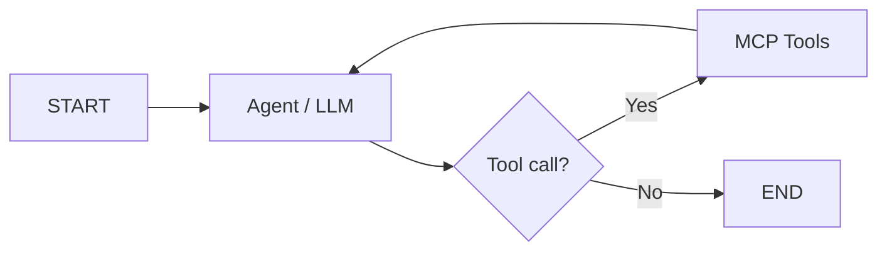

# LangGraph MCP Weather Agent

A production-oriented **AI agent** that uses **LangGraph** for orchestration and the **Model Context Protocol (MCP)** as its tool boundary to resolve US locations, retrieve weather forecasts, and surface active weather alerts.

It focuses on **agent orchestration, dynamic tool discovery, async MCP execution, observability, evaluation, reliability safeguards, containerization, and reproducible local development**.


## Tech Stack

| Layer | Technology |
|---|---|
| Language | Python 3.13 |
| Agent orchestration | LangGraph |
| LLM integration | LangChain |
| Model provider | Groq |
| Model | `openai/gpt-oss-20b` |
| Tool protocol | Model Context Protocol (MCP) |
| MCP SDK | Official MCP Python SDK |
| MCP transport | `stdio` |
| UI | Streamlit |
| Geocoding | Open-Meteo Geocoding API |
| Weather data | US National Weather Service API |
| Package management | `uv` |
| Containerization | Docker |

---

## What this project demonstrates

This repository highlights AI engineering practices:

- **Agent orchestration with LangGraph** using an explicit tool-execution loop.
- **Model Context Protocol (MCP)** integration over `stdio`.
- **Dynamic MCP tool discovery** instead of hardcoded tool schemas.
- **Async tool execution** with the official MCP Python SDK.
- **Separation of concerns** between agent orchestration, MCP capabilities, and UI.
- **Deterministic duplicate-tool protection** to prevent redundant external calls.
- **Context-efficient tool outputs** to reduce unnecessary LLM payload growth.
- **Evaluation harness** for tool selection, arguments, execution success, latency, and unnecessary calls.
- **Structured logging and tool tracing** for debugging and observability.
- **Dockerized deployment** with a non-root runtime user and health check.
- **Reproducible dependency management** with `uv` and `uv.lock`.

---

## Architecture



The responsibilities are intentionally separated:

- **LangGraph** owns reasoning and orchestration.
- **MCP** defines the capability boundary between the agent and external tools.
- **Weather MCP Server** owns weather-specific API integrations.
- **Streamlit** provides a lightweight interactive interface and exposes tool traces for debugging/demo purposes.

---

## Agent workflow

The agent follows a ReAct-style loop:



For a query such as:

```text
What's the weather in Minneapolis and Saint Paul?
```

the agent can resolve both locations, fetch separate forecasts, reuse shared state information, and avoid executing the same state-level alert request more than once.

A typical tool trajectory can look like:

```text
get_location(location="Minneapolis")
get_forecast(lat=..., lon=...)

get_location(location="Saint Paul")
get_forecast(lat=..., lon=...)

get_alerts(state="MN")
```

---

## MCP tools

The weather server currently exposes three MCP tools.

### `get_location(location)`

Resolves a US city or location into:

- latitude
- longitude
- state
- two-letter state code

It uses **Open-Meteo Geocoding API** for coordinates and **NWS `/points` metadata** to derive the state code used by alert queries.

### `get_forecast(lat, lon)`

Retrieves forecast metadata from the **National Weather Service API** for the supplied coordinates and returns a bounded, LLM-friendly forecast.

### `get_alerts(state)`

Retrieves active NWS weather alerts for a US state.

Alert output is intentionally compact to avoid sending unnecessarily large descriptions and instructions back into the LLM context.

---

## Dynamic MCP tool discovery

The agent does not hardcode MCP tool definitions into the LLM layer.

At runtime it:

1. Starts the MCP server over `stdio`.
2. Creates an MCP `ClientSession`.
3. Calls `session.list_tools()`.
4. Converts the discovered MCP schemas into LLM-compatible tool definitions.
5. Binds them dynamically to the model.

This keeps the orchestration layer decoupled from the concrete tool implementation and makes it easier to extend the MCP server later.

### Bounded tool outputs

Weather alerts and forecasts are formatted into compact outputs before being returned to the LLM. This reduces context-window usage, request payload size, latency, and provider-side payload risk.

---

## Evaluation

The repository includes an agent evaluation suite under:

```text
evals/
```

The test set covers behaviors such as:

- direct forecast requests
- direct weather alert requests
- city-to-location resolution
- multi-tool workflows
- no-tool conversational queries
- multi-location scenarios
- argument correctness
- unnecessary tool calls

The evaluation runner measures:

| Metric | Purpose |
|---|---|
| Tool selection accuracy | Did the agent choose the expected tools? |
| First-tool accuracy | Did the workflow start correctly? |
| Argument accuracy | Were tool arguments correct? |
| Execution success rate | Did MCP tool calls complete successfully? |
| Unnecessary tool-call rate | Did the agent avoid irrelevant calls? |
| Latency | How long did the request take? |
| Exception rate | How often did the workflow fail? |

Run the evaluation suite with:

```bash
uv run python evals/run_evals.py
```

The eval suite is intentionally separated from normal static checks because it depends on live external services and LLM behavior.

---

## Observability

The project uses structured Python logging for:

- MCP startup time
- discovered MCP tools
- graph build time
- tool name and arguments
- successful tool completion
- skipped duplicate calls
- agent execution time
- total request latency
- tool/API failures

Example:

```text
INFO | Available MCP tools: ['get_location', 'get_forecast', 'get_alerts']
INFO | Calling MCP tool=get_location arguments={'location': 'Minneapolis'}
INFO | MCP tool completed tool=get_location
INFO | Calling MCP tool=get_forecast arguments={...}
INFO | MCP tool completed tool=get_forecast
INFO | Request completed in 5.81s
```

Because MCP uses `stdio` transport, application logging is written safely without interfering with the MCP protocol stream.

The Streamlit UI also exposes a compact **tool trace** so the user can inspect which MCP tools the agent invoked and with which arguments.

## Local setup

### Prerequisites

- Python 3.13
- `uv`
- Groq API key

Clone the repository:

```bash
git clone <YOUR_GITHUB_REPOSITORY_URL>
cd langgraph-mcp-weather-agent
```

Create the environment and install dependencies:

```bash
uv sync
```

Create a local `.env` based on `.env.example`:

```dotenv
GROQ_API_KEY=your_groq_api_key_here
```

Run the application:

```bash
uv run streamlit run app/streamlit_app.py
```

Then open:

```text
http://localhost:8501
```

---

## Docker

Build the image:

```bash
docker build -t langgraph-mcp-weather-agent .
```

Run it:

```bash
docker run --rm \
  -p 8501:8501 \
  --env-file .env \
  langgraph-mcp-weather-agent
```

On PowerShell:

```powershell
docker run --rm -p 8501:8501 --env-file .env langgraph-mcp-weather-agent
```

The container:

- uses a Python 3.13 + `uv` base image
- installs dependencies from `uv.lock`
- runs the application as a non-root user
- exposes Streamlit on port `8501`
- includes a health check

---

## Docker Compose

Start the application with:

```bash
docker compose up --build
```

Stop it with:

```bash
docker compose down
```

---

## Code quality

Format the project:

```bash
uv run ruff format .
```

Run lint checks:

```bash
uv run ruff check .
```

Recommended local quality gate before opening a pull request:

```bash
uv run ruff format .
uv run ruff check .
```

---

## Example queries

```text
What's the weather in San Francisco?
```

```text
Are there any active weather alerts in California?
```

```text
What's the forecast for 37.7749, -122.4194?
```

```text
What's the weather in Minneapolis and Saint Paul?
```

```text
Compare the weather in Seattle and Portland.
```

---
